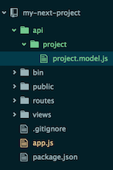

## Milestone 2 - Modeling Our Data

It was mentioned earlier that ExpressJS provides an MVC architecture.  In this milestone, we'll be focusing on the *M* which stands for Model.  We'll be using Mongoose to create Schemas that represent what our data looks like.  Later on, our controllers will use the models and schemas to perform basic CRUD actions for us using methods built into Mongoose.


### Connecting to MongoDB

You installed `mongoose` in the previous milestone, so the next step is to require it in `app.js` and connect to the database.  Open up `app.js` and after the line with `var bodyParser ...` add:

```
var mongoose = require('mongoose');

// Connect to local MongoDB
mongoose.connect('mongodb://localhost/my-next-project');
```

Our app is now requiring the `mongoose` module and attempts to connect to a local MongoDB instance in a database called `my-next-project`.  If you try to run `npm start` at this point, you'll probably experience an `ECONNREFUSED` error.  That's because you haven't started your MongoDB, so your app fails to connect to it.  To run MongoDB, open a new tab in your terminal and type `mongod`.  Now that your database is running, you should be able to run `npm start` without error.  You won't notice a difference in the output, but rest assured you're now connected to your database.  You can confirm by going to your tab that you ran `mongod` in and you'll notice a new connection in the logging output.  If you stop your server, you'll see the connection end as well.

### Automate with nodemon

When you run `npm start`, it pulls in all of your files one time.  That means that if you change any of your server side files after you've started your server, those changes won't be "seen" as NodeJS will not reopen that file.  So after any change, you would have to kill your server and restart it to see the new changes.  This is a pain, and can lead to some frustrating troubleshooting when you forget to restart the server and you can't figure out why your changes aren't showing up.  To help with this, we're going to use a tool perfect for developing node servers.  The tool is called [nodemon](https://github.com/remy/nodemon), it will watch all the files in your directory and if there are any changes it will automatically restart your application for you.  

So let's install `nodemon` with the following command:

```
npm install -g nodemon
```

> Note: Depending on your permissions, you may have to run the command as sudo: `sudo npm install -g nodemon`

This will install `nodemon` globally, to confirm the installation you can type `nodemon -v` and you should see a version number like `1.9.1`.  Now all you have to do when you want to start your server is type `nodemon npm start`.  It's the same command as before, but now we've preceeded `npm start` with `nodemon`.  Now your server will run and as you edit files it will gracefully restart your server so you don't have to remember to do it manually.

### Our First Model - Projects

Now that we have a functioning connection to our database, it's time to think about our data models.  Let's think about what our app is going to do.  The goal is to display projects and allow users to comment on them, which means we'll need to model and store the projects and comments.  

We're going to stray away from the structure that the generator provides a bit.  Create a new directory in the root of your project called `api`, this is where we'll be creating all of our components.  Now create a new directory `api/project` and inside there create a new file called `project.model.js`.  

Your project file structure should now look something like this:



Add the following to the file:

```
var mongoose = require('mongoose');

var ProjectSchema = new mongoose.Schema({
  name: String,
  description: String,
  upvotes: {
    type: Number,
    default: 0
  },
  comments: [{
    type: mongoose.Schema.Types.Objectid,
    ref: 'Comment'
  }],
  creator: String
});

module.exports = mongoose.model('Project', ProjectSchema);
```

Let's quick step through the code, because we'll be using `mongoose` in the file we need to `require` it.  Next we create a new Mongoose Schema object, this is our data model in which we tell Mongoose what fields are part of the model as well as their data types.  For the project model, we've defined two text fields, `name` and `description`.  We've also defined an `upvotes` field which is a Number and we want it to default to `0` and a `comments` field which looks a little weird but basically we are telling Mongoose that this field is actually a collection of references to another data model, Comment.  This will give us some special methods that will allow us to populate the comments automagically.  And lastly a `creator` field which is currently a string, but we'll update this later on in the course to use a `User` model.

That's it!  You just modeled your first data object.  Now using mongo we can perform all the basic CRUD functions on the Project model.  Pretty nice.

### Modeling Comments

We'll need to set up one more model for now, and that is for our comments.  Inside the `api` directory, create a new directory called `comment` and create a file called `comment.model.js`.  Inside the file, type the following:

```
var mongoose = require('mongoose');

var CommentSchema = new mongoose.Schema({
  text: String,
  upvotes: {
    type: Number,
    default: 0
  },
  project: {
    type: mongoose.Schema.Types.ObjectId,
    ref: 'Project'
  },
  creator: String
});

module.exports = mongoose.model('Comment', CommentSchema);
```

This schema looks pretty similar to the `ProjectSchema`, we define various fields and their data types.  Note that we are defining the other side of the relationship between a Project and Comment with the `project` field which is a reference to the project it was created under.

For now, those are the only two models that we will need.  For our next milestone we'll focus on setting up the Controller portion of our MVC.

> See example code for this milestone in this [branch](https://github.com/TNowalk/my-next-project/tree/milestone-2)
